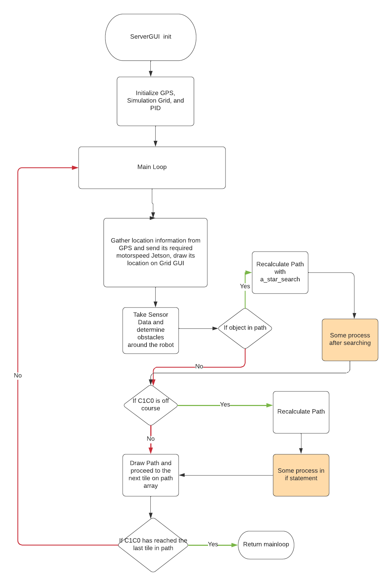

<h1 align="center"> Cornell Cup Path Planning </h1>

## Running Path Planning:

### Virtual Environment Requirements
For python dependencies, see [requirements.txt](requirements.txt)

To activate virtual environment:
```
python3 -m venv venv
(For Linux, run) source venv/bin/activate
(For Windows, run) .\venv\Scripts\Activate.ps1
(For MacOS, run) . venv/bin/activate
pip3 install -r requirements.txt
```
To deactivate:
```
deactivate
```

_Note: Might need to install tkinter differently on some machines_

### &ensp; Run these files:
1. [ServerGUI.py](ServerGUI.py) (can be ran on a local laptop)
2. [Jetson.py](Jetson.py) (on the Jetson with sensor connection)

## Brief Summary of Components:

### SENSOR CODE
The APIs serve as our communication to all the sensors. TEST_API contains functionality to communicate with the IMU, lidar, and terabee; but we also keep three separate APIs (IMU_API, LIDAR_API, and TERABEE_API) for modularized testing when necessary. The R2Protocol contains dependencies for these APIs.

The SensorState polls and updates data from all three sensors.

### INDOOR GPS
The indoor GPS system allows us to visualize C1C0's current location in the area formed by the triangulation of sensors set up in the lab. This helps us keep track of C1C0s motion during its path towards its desired endpoint.

### SERVER-JETSON
Server gets the sensor data information and performs all the computation to determine the optimal path for C1C0 to traverse in order to reach the desired endpoint. In the ServerGUI.py file, we determine the locomotion commands that need to be relayed to the locomotion side of the Jetson and transfer that data via socket communications.

### GENERAL PROGRAM FLOW

